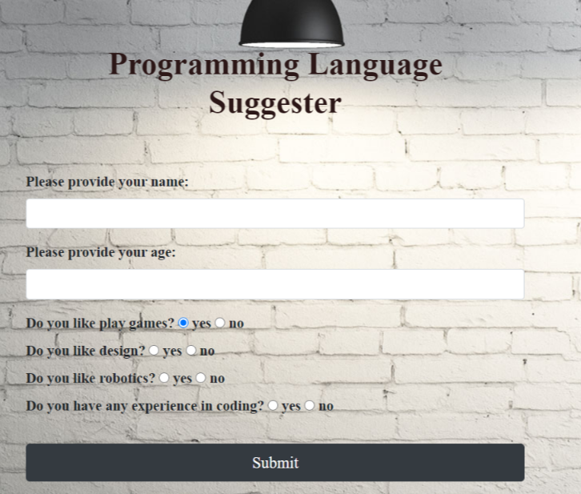

# **Programming Language Suggester**
By Olha Hizhytska

A simple JavaScript interface to obtain a suggestion regarding what first programming language should  to choose.

## Technologies Used:

* JavaScript
* HTML
* CSS
* jQuery
* Bootstrap

## Description

The Programming Language Suggester webpage is for people who want to start learning programming but do not know from what language to start. This application asks users a series of questions about themselves and provides a language suggestion to learn based on their answers.
 

## Setup

- Clone this repository to your desktop, using next command:

  git clone https://github.com/OlgaHi/Programming-Language-Suggester.git

- Navigate to the top level of the directory.

  cd Programming-Language-Suggester

- Open index.html in your browser.

## Known Bugs

- No known issues

## License

[MIT](https://en.wikipedia.org/wiki/MIT_License)
Copyright (c) 2021 Olha Hizhytska

## Contact Information

- Olha Hizhytska olgainfotech@gmail.com

## Please check my Portfolio [here](https://olgahi.github.io/Programming-Language-Suggester/)